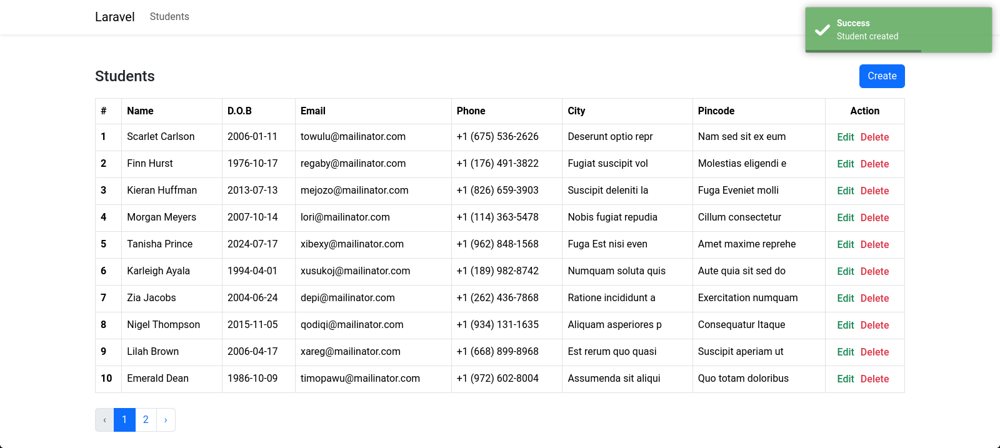
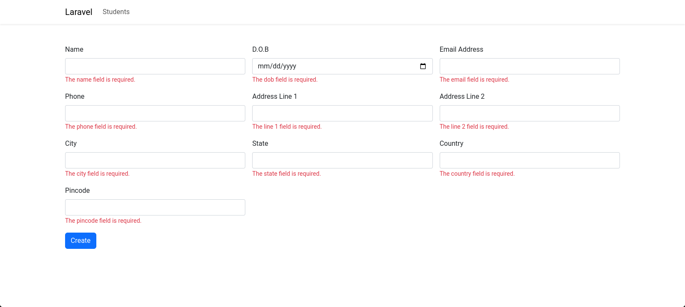

# Laravel 10 One to One Eloquent Relationship

Hi Viewers, In this example you can see the source code of One to One Eloquent Relationship in Laravel 10

## Getting Started

### 1. Create a new project

```
composer create-project laravel/laravel one2one
```

### 2. Navigate to project folder

```
cd one2one
```

### 3. Set your Database name, Username, and Password in the .env file

This folder will be available in your project root folder

```
DB_CONNECTION=mysql
DB_HOST=127.0.0.1
DB_PORT=3306
DB_DATABASE= // set database name
DB_USERNAME= // set username
DB_PASSWORD= // set password
```

### 4. Install Yoeunes toast package

```
composer require yoeunes/toastr
```

### 5. Create a Student Migration and Model

```
php artisan make:model Student -m
```

database/migrations/your_students_table

```
Schema::create('students', function (Blueprint $table) {
    $table->id();
    $table->string('name');
    $table->date('dob');
    $table->string('email');
    $table->string('phone');
    $table->timestamps();
});
```

app/Models/Student.php

```
protected $fillable = [
    'name',
    'dob',
    'email',
    'phone',
];

public function address()
{
    return $this->hasOne(Address::class);
}
```

### 6. Create an Address Migration and Model

```
php artisan make:model Address -m
```

database/migrations/your_addresses_table

```
Schema::create('addresses', function (Blueprint $table) {
    $table->id();
    $table->foreignId('student_id')->constrained()->onDelete('cascade');
    $table->string('line_1');
    $table->string('line_2');
    $table->string('city');
    $table->string('state');
    $table->string('country');
    $table->string('pincode');
    $table->timestamps();
});
```

app/Models/Address.php

```
protected $fillable = [
    'student_id',
    'line_1',
    'line_2',
    'city',
    'state',
    'country',
    'pincode',
];

public function student()
{
    return $this->belongsTo(Student::class);
}
```

### 7. Create Student Controller

```
php artisan make:controller StudentController --model=Student
```

app/Http/Controllers/StudentController.php

```
<?php

namespace App\Http\Controllers;

use App\Models\Student;
use Illuminate\Http\Request;

class StudentController extends Controller
{
    /**
     * Display a listing of the resource.
     */
    public function index()
    {
        $students = Student::orderBy('id', 'desc')->paginate(10);
        return view('students.index', compact('students'))
            ->with('i', (request()->input('page', 1) - 1) * 10);
    }

    /**
     * Show the form for creating a new resource.
     */
    public function create()
    {
        return view('students.create');
    }

    /**
     * Store a newly created resource in storage.
     */
    public function store(Request $request)
    {
        $request->validate([
            'name' => 'required',
            'dob' => 'required|date',
            'email' => 'required|email',
            'phone' => 'required',
            'line_1' => 'required',
            'line_2' => 'required',
            'city' => 'required',
            'state' => 'required',
            'country' => 'required',
            'pincode' => 'required',
        ]);

        $student = Student::create([
            'name' => $request->name,
            'dob' => $request->dob,
            'email' => $request->email,
            'phone' => $request->phone,
        ]);

        $student->address()->create([
            'line_1' => $request->line_1,
            'line_2' => $request->line_2,
            'city' => $request->city,
            'state' => $request->state,
            'country' => $request->country,
            'pincode' => $request->pincode,
        ]);

        toastr()->success('Student created');
        return redirect()->route('students.index');
    }

    /**
     * Show the form for editing the specified resource.
     */
    public function edit(Student $student)
    {
        return view('students.edit', compact('student'));
    }

    /**
     * Update the specified resource in storage.
     */
    public function update(Request $request, Student $student)
    {
        $request->validate([
            'name' => 'required',
            'dob' => 'required|date',
            'email' => 'required|email',
            'phone' => 'required',
            'line_1' => 'required',
            'line_2' => 'required',
            'city' => 'required',
            'state' => 'required',
            'country' => 'required',
            'pincode' => 'required',
        ]);

        $student->update([
            'name' => $request->name,
            'dob' => $request->dob,
            'email' => $request->email,
            'phone' => $request->phone,
        ]);

        $student->address->update([
            'line_1' => $request->line_1,
            'line_2' => $request->line_2,
            'city' => $request->city,
            'state' => $request->state,
            'country' => $request->country,
            'pincode' => $request->pincode,
        ]);

        toastr()->success('Student updated');
        return redirect()->route('students.index');
    }

    /**
     * Remove the specified resource from storage.
     */
    public function destroy(Student $student)
    {
        $student->delete();
        toastr()->success('Student deleted');
        return redirect()->route('students.index');
    }
}
```

### 8. Add students route

routes/web.php

```
<?php

use App\Http\Controllers\StudentController;
use Illuminate\Support\Facades\Route;

/*
|--------------------------------------------------------------------------
| Web Routes
|--------------------------------------------------------------------------
|
| Here is where you can register web routes for your application. These
| routes are loaded by the RouteServiceProvider and all of them will
| be assigned to the "web" middleware group. Make something great!
|
 */

Route::get('/', function () {
    return redirect()->route('students.index');
});

Route::resource('students', StudentController::class)->except('show');
```

### 9. Create Resources

resources/views/layouts/app.blade.php

```
<!DOCTYPE html>
<html lang="en">

<head>
    <meta charset="UTF-8">
    <meta name="viewport" content="width=device-width, initial-scale=1.0">
    <title>@yield('title') | {{env('APP_NAME')}}</title>

    <link rel="stylesheet" href="https://cdn.jsdelivr.net/npm/bootstrap@5.3.2/dist/css/bootstrap.min.css"
        integrity="sha384-T3c6CoIi6uLrA9TneNEoa7RxnatzjcDSCmG1MXxSR1GAsXEV/Dwwykc2MPK8M2HN" crossorigin="anonymous">
</head>

<body>

    @yield('content')

    <script src="https://cdn.jsdelivr.net/npm/bootstrap@5.3.2/dist/js/bootstrap.bundle.min.js"
        integrity="sha384-C6RzsynM9kWDrMNeT87bh95OGNyZPhcTNXj1NW7RuBCsyN/o0jlpcV8Qyq46cDfL"
        crossorigin="anonymous"></script>
</body>

</html>
```

resources/views/students/index.blade.php

```
@extends('layouts.app')
@section('title', 'Students')
@section('content')

<div class="container mt-5">
    <div class="row align-items-center g-3 mb-3">
        <div class="col-md-6">
            <h4 class="mb-0">Students</h4>
        </div>
        <div class="col-md-6 text-md-end">
            <a class="btn btn-primary" href="{{route('students.create')}}">
                Create
            </a>
        </div>
    </div>

    <div class="table-responsive">
        <table class="table table-hover table-bordered">
            <thead>
                <tr>
                    <th scope="col">#</th>
                    <th scope="col">Name</th>
                    <th scope="col">D.O.B</th>
                    <th scope="col">Email</th>
                    <th scope="col">Phone</th>
                    <th scope="col">City</th>
                    <th scope="col">Pincode</th>
                    <th class="text-center" scope="col">Action</th>
                </tr>
            </thead>
            <tbody>
                @foreach($students as $student)
                <tr>
                    <th scope="row">{{++$i}}</th>
                    <td>{{$student->name}}</td>
                    <td>{{$student->dob}}</td>
                    <td>{{$student->email}}</td>
                    <td>{{$student->phone}}</td>
                    <td>{{$student->address->city}}</td>
                    <td>{{$student->address->pincode}}</td>
                    <td class="text-center">
                        <form action="{{route('students.destroy', $student->id)}}" method="post">
                            @csrf @method('delete')
                            <a class="text-success fw-medium" href="{{route('students.edit', $student->id)}}">
                                Edit
                            </a>
                            <button class="border-0 bg-transparent text-danger fw-medium" type="submit">Delete</button>
                        </form>
                    </td>
                </tr>
                @endforeach
            </tbody>
        </table>
        @if($students instanceof \Illuminate\Pagination\LengthAwarePaginator)
        <div class="mt-4">
            {!! $students->links() !!}
        </div>
        @endif
    </div>
</div>

@endsection
```

resources/views/students/create.blade.php

```
@extends('layouts.app')
@section('title', 'New Student')
@section('content')

<div class="container mt-5">
    <form class="row g-3" action="{{route('students.store')}}" method="post">
        @csrf
        <div class="col-md-4">
            <label class="form-label" for="nameInp">Name</label>
            <input class="form-control" id="nameInp" type="text" name="name" value="{{old('name')}}">
            @error('name')<small class="text-danger">{{$message}}</small>@enderror
        </div>
        <div class="col-md-4">
            <label class="form-label" for="dobInp">D.O.B</label>
            <input class="form-control" id="dobInp" type="date" name="dob" value="{{old('dob')}}">
            @error('dob')<small class="text-danger">{{$message}}</small>@enderror
        </div>
        <div class="col-md-4">
            <label class="form-label" for="emailInp">Email Address</label>
            <input class="form-control" id="emailInp" type="email" name="email" value="{{old('email')}}">
            @error('email')<small class="text-danger">{{$message}}</small>@enderror
        </div>
        <div class="col-md-4">
            <label class="form-label" for="phoneInp">Phone</label>
            <input class="form-control" id="phoneInp" type="text" name="phone" value="{{old('phone')}}">
            @error('phone')<small class="text-danger">{{$message}}</small>@enderror
        </div>
        <div class="col-md-4">
            <label class="form-label" for="line1Inp">Address Line 1</label>
            <input class="form-control" id="line1Inp" type="text" name="line_1" value="{{old('line_1')}}">
            @error('line_1')<small class="text-danger">{{$message}}</small>@enderror
        </div>
        <div class="col-md-4">
            <label class="form-label" for="line2Inp">Address Line 2</label>
            <input class="form-control" id="line2Inp" type="text" name="line_2" value="{{old('line_2')}}">
            @error('line_2')<small class="text-danger">{{$message}}</small>@enderror
        </div>
        <div class="col-md-4">
            <label class="form-label" for="cityInp">City</label>
            <input class="form-control" id="cityInp" type="text" name="city" value="{{old('city')}}">
            @error('city')<small class="text-danger">{{$message}}</small>@enderror
        </div>
        <div class="col-md-4">
            <label class="form-label" for="stateInp">State</label>
            <input class="form-control" id="stateInp" type="text" name="state" value="{{old('state')}}">
            @error('state')<small class="text-danger">{{$message}}</small>@enderror
        </div>
        <div class="col-md-4">
            <label class="form-label" for="countryInp">Country</label>
            <input class="form-control" id="countryInp" type="text" name="country" value="{{old('country')}}">
            @error('country')<small class="text-danger">{{$message}}</small>@enderror
        </div>
        <div class="col-md-4">
            <label class="form-label" for="pincodeInp">Pincode</label>
            <input class="form-control" id="pincodeInp" type="text" name="pincode" value="{{old('pincode')}}">
            @error('pincode')<small class="text-danger">{{$message}}</small>@enderror
        </div>
        <div class="col-12">
            <button class="btn btn-primary" type="submit">Create</button>
        </div>
    </form>
</div>

@endsection
```

resources/views/students/edit.blade.php

```
@extends('layouts.app')
@section('title', 'Edit Student')
@section('content')

<div class="container mt-5">
    <form class="row g-3" action="{{route('students.update', $student->id)}}" method="post">
        @csrf @method('put')
        <div class="col-md-4">
            <label class="form-label" for="nameInp">Name</label>
            <input class="form-control" id="nameInp" type="text" name="name" value="{{$student->name}}">
            @error('name')<small class="text-danger">{{$message}}</small>@enderror
        </div>
        <div class="col-md-4">
            <label class="form-label" for="dobInp">D.O.B</label>
            <input class="form-control" id="dobInp" type="date" name="dob" value="{{$student->dob}}">
            @error('dob')<small class="text-danger">{{$message}}</small>@enderror
        </div>
        <div class="col-md-4">
            <label class="form-label" for="emailInp">Email Address</label>
            <input class="form-control" id="emailInp" type="email" name="email" value="{{$student->email}}">
            @error('email')<small class="text-danger">{{$message}}</small>@enderror
        </div>
        <div class="col-md-4">
            <label class="form-label" for="phoneInp">Phone</label>
            <input class="form-control" id="phoneInp" type="text" name="phone" value="{{$student->phone}}">
            @error('phone')<small class="text-danger">{{$message}}</small>@enderror
        </div>
        <div class="col-md-4">
            <label class="form-label" for="line1Inp">Address Line 1</label>
            <input class="form-control" id="line1Inp" type="text" name="line_1" value="{{$student->address->line_1}}">
            @error('line_1')<small class="text-danger">{{$message}}</small>@enderror
        </div>
        <div class="col-md-4">
            <label class="form-label" for="line2Inp">Address Line 2</label>
            <input class="form-control" id="line2Inp" type="text" name="line_2" value="{{$student->address->line_2}}">
            @error('line_2')<small class="text-danger">{{$message}}</small>@enderror
        </div>
        <div class="col-md-4">
            <label class="form-label" for="cityInp">City</label>
            <input class="form-control" id="cityInp" type="text" name="city" value="{{$student->address->city}}">
            @error('city')<small class="text-danger">{{$message}}</small>@enderror
        </div>
        <div class="col-md-4">
            <label class="form-label" for="stateInp">State</label>
            <input class="form-control" id="stateInp" type="text" name="state" value="{{$student->address->state}}">
            @error('state')<small class="text-danger">{{$message}}</small>@enderror
        </div>
        <div class="col-md-4">
            <label class="form-label" for="countryInp">Country</label>
            <input class="form-control" id="countryInp" type="text" name="country"
                value="{{$student->address->country}}">
            @error('country')<small class="text-danger">{{$message}}</small>@enderror
        </div>
        <div class="col-md-4">
            <label class="form-label" for="pincodeInp">Pincode</label>
            <input class="form-control" id="pincodeInp" type="text" name="pincode"
                value="{{$student->address->pincode}}">
            @error('pincode')<small class="text-danger">{{$message}}</small>@enderror
        </div>
        <div class="col-12">
            <button class="btn btn-primary" type="submit">Create</button>
        </div>
    </form>
</div>

@endsection
```

### 10. Adding Custom CSS (Optional)

public/css/main.css

```
@import url("https://fonts.googleapis.com/css2?family=Roboto:ital,wght@0,100;0,300;0,400;0,500;0,700;0,900;1,100;1,300;1,400;1,500;1,700;1,900&display=swap");

/*--------------------------------------------------------------
# General
--------------------------------------------------------------*/
:root {
    scroll-behavior: smooth;
}

body {
    font-family: "Roboto", sans-serif;
}

a {
    cursor: pointer;
    text-decoration: none;
}

a:hover,
a:focus {
    text-decoration: none;
}

input:-webkit-autofill,
input:-webkit-autofill:hover,
input:-webkit-autofill:focus,
input:-webkit-autofill:active {
    transition: background-color 5000s ease-in-out 0s;
}

textarea {
    resize: none;
}

hr {
    margin: 10px 0px;
    color: darkgray;
}

::-moz-selection {
    color: #ffffff;
    background: var(--bs-primary);
}

::selection {
    color: #ffffff;
    background: var(--bs-primary);
}

::-webkit-scrollbar {
    width: 5px;
    height: 8px;
    background-color: #fff;
}

::-webkit-scrollbar-thumb {
    background-color: #aab7cf;
}

/*--------------------------------------------------------------
# Override some default Bootstrap stylings
--------------------------------------------------------------*/
*:focus {
    box-shadow: none !important;
    outline: 0px !important;
}

.form-control,
.form-select {
    border-radius: 4px;
    border: 1px solid #ced4da;
}

.form-control:focus,
.form-select:focus {
    background-color: #fdfdfd;
    border: 1.5px solid var(--bs-primary);
    outline: 0;
    box-shadow: 0 0 0.25rem 0.05rem rgba(105, 108, 255, 0.1);
}
```

resources/views/layouts/app.blade.php

> Add the below line inside your head tag

```
<link rel="stylesheet" href="{{asset('css/main.css')}}">
```

### 11. Run your project

```
php artisan serve
```

### 12. To fix bootstrap pagination issue

app/Providers/AppServiceProvider.php

```
/**
 * Bootstrap any application services.
 */
public function boot(): void
{
    \Illuminate\Pagination\Paginator::useBootstrap();
}
```

## Screenshot


<br>

